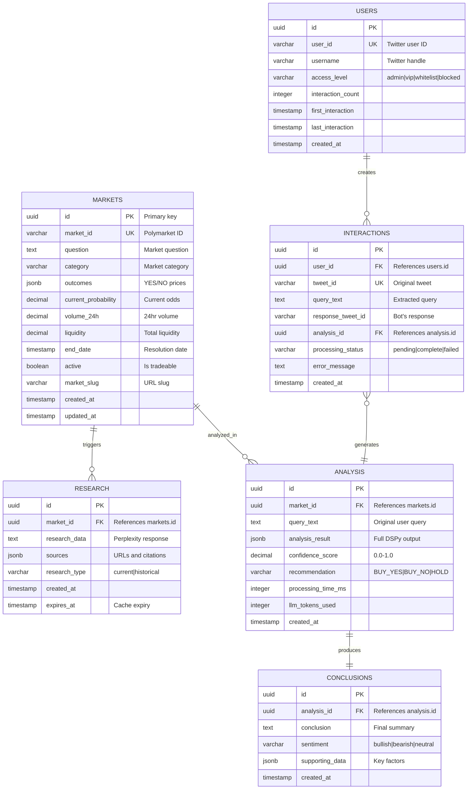

# Database Design

AIGG Insights uses PostgreSQL as its primary data store with live synchronization to Polymarket's complete market dataset, currently tracking hundreds of thousands of markets with thousands of actively traded markets updated in real-time.

## Database Schema Overview

The production database maintains real-time synchronization with Polymarket's complete market data, providing instant access to hundreds of thousands of prediction markets for analysis.



## Core Tables

### 1. polymarket_markets

Primary table storing all Polymarket prediction markets.

```sql
CREATE TABLE polymarket_markets (
    id UUID PRIMARY KEY DEFAULT gen_random_uuid(),
    market_id VARCHAR(255) UNIQUE NOT NULL,
    question TEXT NOT NULL,
    category VARCHAR(100),
    outcomes JSONB,
    current_probability DECIMAL(5,4),
    volume_24h DECIMAL(20,2),
    liquidity DECIMAL(20,2),
    end_date TIMESTAMP,
    active BOOLEAN DEFAULT true,
    market_slug VARCHAR(255),
    created_at TIMESTAMP DEFAULT CURRENT_TIMESTAMP,
    updated_at TIMESTAMP DEFAULT CURRENT_TIMESTAMP
);

-- Indexes for performance
CREATE INDEX idx_markets_category ON polymarket_markets(category);
CREATE INDEX idx_markets_active ON polymarket_markets(active);
CREATE INDEX idx_markets_end_date ON polymarket_markets(end_date);
CREATE INDEX idx_markets_question_gin ON polymarket_markets USING gin(to_tsvector('english', question));
```

### Sample Data Structure
```json
{
  "market_id": "0x1234...",
  "question": "Will Bitcoin reach $200,000 by December 31, 2025?",
  "category": "Crypto",
  "outcomes": [
    {"name": "Yes", "price": 0.085},
    {"name": "No", "price": 0.915}
  ],
  "current_probability": 0.085,
  "volume_24h": 125000.50,
  "liquidity": 500000.00,
  "end_date": "2025-12-31T23:59:59Z"
}
```

### 2. research

Stores research data gathered for market analysis.

```sql
CREATE TABLE research (
    id UUID PRIMARY KEY DEFAULT gen_random_uuid(),
    market_id UUID REFERENCES polymarket_markets(id),
    research_data TEXT,
    sources JSONB,
    research_type VARCHAR(50),
    created_at TIMESTAMP DEFAULT CURRENT_TIMESTAMP,
    expires_at TIMESTAMP
);

CREATE INDEX idx_research_market ON research(market_id);
CREATE INDEX idx_research_expires ON research(expires_at);
```

### 3. analysis

Records of all analyses performed by the system.

```sql
CREATE TABLE analysis (
    id UUID PRIMARY KEY DEFAULT gen_random_uuid(),
    market_id UUID REFERENCES polymarket_markets(id),
    query_text TEXT NOT NULL,
    analysis_result JSONB,
    confidence_score DECIMAL(3,2),
    recommendation VARCHAR(50),
    processing_time_ms INTEGER,
    llm_tokens_used INTEGER,
    created_at TIMESTAMP DEFAULT CURRENT_TIMESTAMP
);

CREATE INDEX idx_analysis_market ON analysis(market_id);
CREATE INDEX idx_analysis_created ON analysis(created_at DESC);
```

### 4. conclusions

Final trading recommendations and conclusions.

```sql
CREATE TABLE conclusions (
    id UUID PRIMARY KEY DEFAULT gen_random_uuid(),
    analysis_id UUID REFERENCES analysis(id) UNIQUE,
    conclusion TEXT NOT NULL,
    sentiment VARCHAR(20),
    supporting_data JSONB,
    created_at TIMESTAMP DEFAULT CURRENT_TIMESTAMP
);
```

### 5. twitter_users

User management for access control.

```sql
CREATE TABLE twitter_users (
    id UUID PRIMARY KEY DEFAULT gen_random_uuid(),
    user_id VARCHAR(100) UNIQUE NOT NULL,
    username VARCHAR(100),
    access_level VARCHAR(20) DEFAULT 'whitelist',
    interaction_count INTEGER DEFAULT 0,
    first_interaction TIMESTAMP,
    last_interaction TIMESTAMP,
    created_at TIMESTAMP DEFAULT CURRENT_TIMESTAMP
);

CREATE INDEX idx_users_access ON twitter_users(access_level);
CREATE INDEX idx_users_username ON twitter_users(username);
```

### 6. twitter_interactions

Tracks all Twitter bot interactions.

```sql
CREATE TABLE twitter_interactions (
    id UUID PRIMARY KEY DEFAULT gen_random_uuid(),
    user_id UUID REFERENCES twitter_users(id),
    tweet_id VARCHAR(100) UNIQUE,
    query_text TEXT,
    response_tweet_id VARCHAR(100),
    analysis_id UUID REFERENCES analysis(id),
    processing_status VARCHAR(20),
    error_message TEXT,
    created_at TIMESTAMP DEFAULT CURRENT_TIMESTAMP
);

CREATE INDEX idx_interactions_user ON twitter_interactions(user_id);
CREATE INDEX idx_interactions_status ON twitter_interactions(processing_status);
```

## Data Management Strategies

### 1. Market Data Updates (Live Production)

Markets are synchronized with Polymarket API in real-time:

```python
async def update_market_data():
    """Runs every 5 minutes in production"""
    # Fetches from live Polymarket API
    active_markets = await polymarket_api.fetch_active_markets()
    # Hundreds of thousands of total markets synchronized

    for market in active_markets:
        await upsert_market(market)

    # Clean up expired markets
    await deactivate_expired_markets()
```

### 2. Auto-Cleanup Strategy

Maintains database performance by archiving old data:

```sql
-- Archive old analyses (>30 days)
INSERT INTO analysis_archive
SELECT * FROM analysis
WHERE created_at < NOW() - INTERVAL '30 days';

DELETE FROM analysis
WHERE created_at < NOW() - INTERVAL '30 days';

-- Remove expired research
DELETE FROM research
WHERE expires_at < NOW();
```

### 3. Active Market Management

Maintains thousands of active markets from hundreds of thousands of total synchronized markets:

```python
def maintain_active_markets():
    """
    Criteria for active markets (live production):
    - End date in future
    - Volume > $1000 in last 24 hours
    - Liquidity > $5,000
    - Market not resolved
    - Real-time synchronization with Polymarket API
    """
    query = """
    UPDATE polymarket_markets
    SET active = false
    WHERE end_date < NOW()
       OR volume_24h < 1000
       OR liquidity < 10000
    """
```

## Performance Optimizations

### 1. Indexing Strategy

Critical indexes for query performance:

```sql
-- Full-text search on questions
CREATE INDEX idx_markets_question_fts
ON polymarket_markets
USING gin(to_tsvector('english', question));

-- Composite index for category filtering
CREATE INDEX idx_markets_category_active
ON polymarket_markets(category, active)
WHERE active = true;

-- Partial index for active markets
CREATE INDEX idx_markets_active_only
ON polymarket_markets(market_id)
WHERE active = true;
```

### 2. Connection Pooling

```python
# Database configuration
DATABASE_CONFIG = {
    "min_connections": 5,
    "max_connections": 20,
    "connection_timeout": 10,
    "idle_timeout": 300,
    "max_lifetime": 3600
}
```

### 3. Query Optimization

```sql
-- Efficient market search with relevance scoring
WITH ranked_markets AS (
    SELECT
        m.*,
        ts_rank(to_tsvector('english', question), query) AS relevance
    FROM
        polymarket_markets m,
        plainto_tsquery('english', $1) query
    WHERE
        to_tsvector('english', question) @@ query
        AND active = true
    ORDER BY
        relevance DESC,
        volume_24h DESC
    LIMIT 10
)
SELECT * FROM ranked_markets;
```

## Backup & Recovery

### Backup Strategy

```bash
# Daily full backup
pg_dump -h localhost -U aigg_user -d aigg_insights \
    -f /backups/aigg_$(date +%Y%m%d).sql

# Hourly incremental via WAL archiving
archive_command = 'cp %p /wal_archive/%f'
```

### Recovery Procedures

```bash
# Restore from backup
psql -h localhost -U aigg_user -d aigg_insights \
    -f /backups/aigg_20250127.sql

# Point-in-time recovery
recovery_target_time = '2025-01-27 14:30:00'
```

## Monitoring Queries

### Database Health Checks

```sql
-- Table sizes
SELECT
    schemaname,
    tablename,
    pg_size_pretty(pg_total_relation_size(schemaname||'.'||tablename)) AS size
FROM pg_tables
WHERE schemaname = 'public'
ORDER BY pg_total_relation_size(schemaname||'.'||tablename) DESC;

-- Slow queries
SELECT
    query,
    calls,
    mean_exec_time,
    total_exec_time
FROM pg_stat_statements
ORDER BY mean_exec_time DESC
LIMIT 10;

-- Connection status
SELECT
    datname,
    count(*) as connections,
    state
FROM pg_stat_activity
GROUP BY datname, state;
```

## Migration Management

Using Alembic for schema versioning:

```python
# alembic/versions/001_initial_schema.py
def upgrade():
    op.create_table(
        'polymarket_markets',
        sa.Column('id', sa.UUID(), primary_key=True),
        # ... other columns
    )

def downgrade():
    op.drop_table('polymarket_markets')
```

## Future Considerations

### Planned Improvements
1. **Partitioning**: Time-based partitioning for analysis table
2. **Read Replicas**: Separate read/write workloads
3. **Caching Layer**: Redis for frequent queries
4. **Time-Series Data**: TimescaleDB for market metrics
5. **Graph Relationships**: Neo4j for market correlations