# Demo Examples

## Video Walkthrough

<iframe src="https://www.loom.com/embed/YOUR_LOOM_VIDEO_ID_HERE" width="100%" height="450" frameborder="0" allowfullscreen></iframe>

## Working Examples

### Cryptocurrency Markets

**Query**: `@VigVinnie Will Bitcoin reach 150k?`

**Response**:
```
Word is Bitcoin's reeling below $110K after a brutal selloff —
over $1.7B in liquidations and ETF outflows piling up. Smart
money's laying heavy on NO with the Fed tightening. (82% confidence)

BUY NO

https://polymarket.com/event/will-bitcoin-reach-150000-in-august-2025
```

**Technical Process**:
1. Query parsed for keywords: "Bitcoin", "150k"
2. Market matcher finds: "Will Bitcoin reach $150,000 by December 31, 2025?"
3. Research API pulls current BTC price ($109,850), liquidation data
4. Analysis determines 82% confidence for NO based on market conditions

### Political Markets

**Query**: `@VigVinnie Trump 2028?`

**Response**:
```
Word is the Supremes just shut the door on any 2028 comeback—
22nd Amendment's still ironclad. The line's crooked if it gives
Trump a shot. Lay your action on NO. (98% confidence)

BUY NO

https://polymarket.com/event/will-donald-trump-win-2028-election
```

**Market Matching**: Constitutional constraint triggers 98% confidence NO

### Economic Markets

**Query**: `@VigVinnie will the fed cut rates soon?`

**Response**:
```
Word is the Fed already dropped rates in July and Powell's
signaling more cuts. Smart money's leaning hard on YES.
The line's moving, the juice is low. (90% confidence)

BUY YES

https://polymarket.com/event/will-1-fed-rate-cut-happen-in-2025
```

**Data Sources**: FOMC minutes, Fed futures, employment data

## Response Patterns

### Two-Tweet Structure

```python
def post_response(self, analysis_result, original_tweet_id):
    # Tweet 1: Analysis text
    main_tweet = self.client.create_tweet(
        text=analysis_result.short_analysis,
        in_reply_to_tweet_id=original_tweet_id
    )

    # Tweet 2: URL only (generates preview)
    url_tweet = self.client.create_tweet(
        text=analysis_result.market_url,
        in_reply_to_tweet_id=main_tweet.data['id']
    )
```

### Vinnie Persona Implementation

From `dspy_enhanced_aigg_flow.py:83-92`:
```python
# High confidence: "Trust me on this one - sharp money's moving heavy..."
# Medium confidence: "Something's cooking here, the vig's telling a story..."
# Low confidence: "Fuggedaboutit for now - too murky for my taste..."
```

## Error Handling

### Market Not Found
```
Can't find that market in my book. Try being more specific—
team name, date, price level.
```

### Ambiguous Query
```
Which stock market you talking about? S&P 500? Tesla?
Give me something specific.
```

## Performance Metrics

```mermaid
gantt
    title Response Timeline (13 seconds total)
    dateFormat X
    axisFormat %s

    section Detection
    Polling          :done, poll, 0, 30
    Parse Query      :done, parse, 30, 1

    section Analysis
    Market Matching  :active, match, 31, 2
    Research Data    :active, research, 33, 5
    Generate Signal  :active, gen, 38, 3

    section Response
    Format Tweet     :format, 41, 1
    Post Thread      :post, 42, 1
```



| Stage | Duration | Component |
|-------|----------|-----------|
| Query Detection | 30s | Twitter API polling |
| Market Matching | 2s | LLM semantic search |
| Research | 5s | Perplexity API |
| Analysis | 3s | DSPy pipeline |
| Response | 1s | Tweet posting |
| **Total** | **~13s** | End-to-end |

## Testing Queries

### Valid Queries
- Specific price targets: "ETH to 10k?"
- Time-bound events: "Biden approval above 50% by March?"
- Binary outcomes: "Fed hike in Q1?"

### Invalid Queries
- Too vague: "markets?"
- Multiple questions: "Bitcoin and ETH prices?"
- Non-market: "What's the weather?"

## API Integration

### Direct Analysis
```bash
curl -X POST http://localhost:8003/analyze \
  -H "Content-Type: application/json" \
  -d '{
    "query": "Bitcoin 200k?",
    "user_id": "123",
    "user_handle": "test"
  }'
```

### Market Search
```bash
curl "http://localhost:8001/markets/search?q=bitcoin&limit=5"
```

## Tweet Embeds

<!-- Add actual tweet IDs here -->
<blockquote class="twitter-tweet">
  <a href="https://twitter.com/VigVinnie/status/ACTUAL_TWEET_ID"></a>
</blockquote>

<script async src="https://platform.twitter.com/widgets.js"></script>