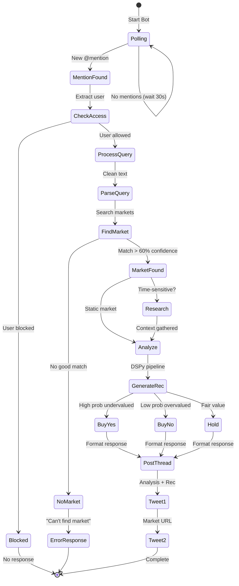

# Twitter Bot Overview

The AIGG Twitter bot (@VigVinnie) is the primary user interface for market analysis, providing instant AI-powered trading recommendations through simple tweet interactions.

## How It Works

### User Interaction Flow

1. **User tweets** a market question mentioning @VigVinnie
2. **Bot detects** the mention within 30 seconds
3. **Analysis pipeline** processes the query
4. **Bot responds** with a 2-tweet thread:
   - Tweet 1: Analysis and recommendation
   - Tweet 2: Direct Polymarket link

### Response Pattern

The bot follows a consistent 2-tweet pattern for optimal engagement:

```
Tweet 1 (Analysis):
"Word is Bitcoin's struggling below $110K after brutal
selloffs. Smart money's laying action on NO with Fed
tightening. (85% confidence)

BUY NO"

Tweet 2 (Link):
"https://polymarket.com/event/bitcoin-200k-2025"
```

## Decision Flow




## Bot Architecture

### Core Components

```python
class TwitterBot:
    def __init__(self):
        self.client = tweepy.Client(bearer_token=BEARER_TOKEN)
        self.api = tweepy.API(auth)
        self.db = DatabaseConnection()
        self.analyzer = DSPyEnhancedAIGGFlow()

    def monitor_mentions(self):
        """Main loop - checks for new mentions"""

    def process_mention(self, tweet):
        """Handles individual mention"""

    def post_response(self, analysis, original_tweet):
        """Creates threaded response"""
```

### Monitoring System

The bot runs continuously with configurable intervals:

- **X Premium**: 30-second intervals (recommended)
- **Free Tier**: 15-minute intervals (API limits)
- **Development**: Dry-run mode (no posting)

## Technical Implementation

### Tweet Detection

```python
def get_new_mentions(self, since_id=None):
    """Fetch unprocessed mentions"""
    mentions = self.client.get_users_mentions(
        id=self.user_id,
        since_id=since_id,
        max_results=10,
        tweet_fields=['created_at', 'author_id', 'conversation_id']
    )
    return mentions.data or []
```

### Query Processing

The bot extracts and cleans user queries:

1. **Remove mentions**: Strip @VigVinnie from text
2. **Clean text**: Remove extra whitespace, URLs
3. **Extract question**: Identify the core market query
4. **Validate**: Ensure query is processable

### Response Generation

```python
def generate_response(self, query: str) -> TweetResponse:
    # 1. Find relevant markets
    markets = self.market_matcher.find_markets(query)

    # 2. Generate analysis
    analysis = self.analyzer.process_query(query, markets)

    # 3. Format for Twitter
    tweet_text = self.format_tweet(analysis)
    market_url = analysis.market_url

    return TweetResponse(
        main_tweet=tweet_text,
        link_tweet=market_url,
        confidence=analysis.confidence
    )
```

## Vinnie Persona

The bot adopts "Vinnie" - a Brooklyn bookmaker personality:

### Character Traits
- **Voice**: Street-smart, confident, direct
- **Vocabulary**: Betting slang ("the line", "smart money", "action")
- **Phrases**: "Word is...", "capisce?", "trust the tape"
- **Tone**: Authoritative but approachable

### Example Responses

```
"Word from the grounds is Alcaraz is dialed in—dropped
one set all tournament. My cousin at the club says the
kid's footwork is unreal. This line's a gift."

"The Supremes just shut the door on any 2028 comeback—
22nd Amendment's ironclad. Smart money knows this one's
a no-go. Lay your action on NO and walk away clean."
```

## Rate Limiting

### Twitter API Limits

Limits and pricing depend on your X tier; see [X's developer docs](https://developer.twitter.com/en/products/twitter-api) for current rates and limits.

### Implementation Strategy

```python
class RateLimiter:
    def __init__(self):
        self.buckets = {
            'read': TokenBucket(rate=300, capacity=300, period=900),
            'write': TokenBucket(rate=300, capacity=300, period=10800)
        }

    def can_read(self) -> bool:
        return self.buckets['read'].consume(1)

    def can_write(self) -> bool:
        return self.buckets['write'].consume(2)  # 2 tweets per response
```

## Access Control

### User Tiers

1. **Admin**: Full access, priority processing
2. **VIP**: Enhanced limits, faster responses
3. **Whitelist**: Standard access
4. **Blocked**: No responses

### Implementation

```python
def check_access(self, user_id: str) -> AccessLevel:
    user = self.db.get_user(user_id)

    if user.access_level == 'blocked':
        return AccessLevel.BLOCKED

    if user.access_level == 'admin':
        return AccessLevel.ADMIN

    if self.whitelist_disabled:
        return AccessLevel.WHITELIST

    return user.access_level or AccessLevel.BLOCKED
```

## Error Handling

### Common Scenarios

#### Market Not Found
```
"Can't find that market in my book. Try being more
specific—team name, date, price level. The sharps
need details to lay action."
```

#### API Timeout
```
"The wire's jammed up. Give me a minute and try
again. Sometimes the action gets too hot."
```

#### Rate Limited
```
"Taking a breather—too much action. Back in 5."
```

## Performance Metrics

### Response Times

| Component | Average Time | Max Time |
|-----------|-------------|----------|
| Mention Detection | 30s | 60s |
| Market Matching | 2s | 5s |
| Analysis Generation | 8s | 15s |
| Tweet Posting | 1s | 3s |
| **Total** | **13s** | **25s** |

### Success Rates

- **Mention Detection**: High reliability
- **Market Match**: Designed for high relevance; actual results vary
- **Analysis Success**: High reliability with DSPy structured outputs
- **Tweet Delivery**: High reliability

## Monitoring & Logging

### Key Metrics

```python
@dataclass
class BotMetrics:
    mentions_processed: int
    responses_sent: int
    errors_encountered: int
    average_response_time: float
    api_calls_remaining: dict

def log_metrics(self):
    metrics = self.collect_metrics()
    logger.info(f"Bot Stats: {metrics}")
    self.send_to_monitoring(metrics)
```

### Health Checks

```python
def health_check(self) -> dict:
    return {
        "status": "healthy" if self.is_running else "stopped",
        "last_mention": self.last_mention_time,
        "mentions_today": self.mentions_count,
        "errors_today": self.error_count,
        "api_limits": self.get_api_limits()
    }
```

## Configuration

### Environment Variables

```bash
# Twitter API Credentials
TWITTER_API_KEY=your_api_key
TWITTER_API_SECRET=your_api_secret
TWITTER_ACCESS_TOKEN=your_access_token
TWITTER_ACCESS_TOKEN_SECRET=your_token_secret
TWITTER_BEARER_TOKEN=your_bearer_token

# Bot Configuration
TWITTER_USERNAME=VigVinnie
TWITTER_CHECK_INTERVAL=30  # seconds
TWITTER_DRY_RUN=false
TWITTER_DISABLE_WHITELIST=false
TWITTER_MAX_MENTIONS_PER_CYCLE=10

# Persona Settings
BOT_PERSONA=vinnie  # or 'professional', 'technical'
BOT_CONFIDENCE_THRESHOLD=0.6
BOT_MAX_TWEET_LENGTH=500
```

### Command Line Options

```bash
# Production mode
python main.py twitter-bot \
    --interval 30 \
    --disable-whitelist

# Development mode
python main.py twitter-bot \
    --dry-run \
    --verbose \
    --interval 60

# Limited operation
python main.py twitter-bot \
    --max-mentions 5 \
    --whitelist-only
```

## Deployment

### Systemd Service

```ini
[Unit]
Description=AIGG Twitter Bot
After=network.target

[Service]
Type=simple
User=aigg
WorkingDirectory=/opt/aigg-insights
ExecStart=/opt/aigg-insights/venv/bin/python main.py twitter-bot --interval 30
Restart=always
RestartSec=30

[Install]
WantedBy=multi-user.target
```

### Docker Deployment

```dockerfile
FROM python:3.11-slim

WORKDIR /app
COPY requirements.txt .
RUN pip install -r requirements.txt

COPY . .

CMD ["python", "main.py", "twitter-bot", "--interval", "30"]
```

## Testing

### Unit Tests

```python
def test_mention_processing():
    bot = TwitterBot(dry_run=True)
    mention = create_mock_mention("Will Bitcoin hit 200k?")

    response = bot.process_mention(mention)

    assert response.confidence > 0.6
    assert "BUY" in response.main_tweet
    assert "polymarket.com" in response.link_tweet
```

### Integration Tests

```python
def test_full_flow():
    bot = TwitterBot(dry_run=True)

    # Simulate mention
    mention = create_real_mention()

    # Process through full pipeline
    response = bot.handle_mention(mention)

    # Verify response
    assert response.posted_successfully
    assert response.response_time < 30
```

## Troubleshooting

### Bot Not Responding

1. Check API credentials are valid
2. Verify rate limits not exceeded
3. Check database connection
4. Review error logs
5. Test analysis pipeline separately

### Slow Responses

1. Check network latency
2. Verify LLM API performance
3. Optimize database queries
4. Review market matching efficiency
5. Consider caching strategy

### Incorrect Markets

1. Review market matching logic
2. Check database synchronization
3. Verify market data freshness
4. Test query parsing
5. Review LLM prompts

## Future Enhancements

### Planned Features

1. **Multi-language support**: Respond in user's language
2. **Image analysis**: Process chart screenshots
3. **Proactive alerts**: Notify users of market movements
4. **Thread summaries**: Aggregate multiple related queries
5. **DM support**: Private analysis for premium users

---

> **Disclaimer:** This is not investment advice. Prediction markets are volatile and markets/odds change frequently. Examples are illustrative; links may resolve or become unavailable.